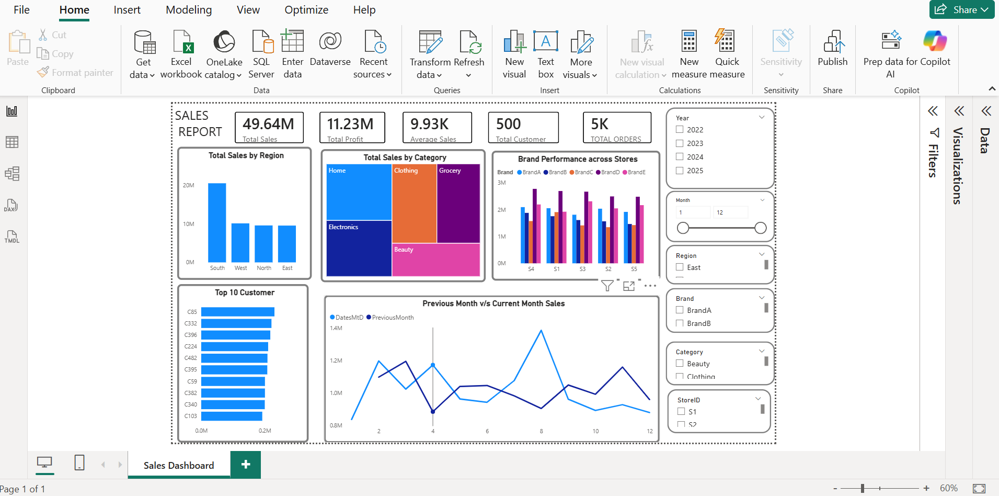

# 🛒 Retail Sales Dashboard — Power BI

A single-page Power BI report that gives retail teams an at-a-glance view of sales performance across regions, categories, brands, stores, and customers, with month-over-month trend analysis.

---

## 📸 Dashboard Preview



---

## 📁 Project Structure

```
retail-powerbi/
├── Retail_dashboard.pbix        # Main Power BI report file
├── physical_data_model.docx     # Data model diagram (SmartArt)
├── screenshot_of_my_dashboard.png
└── README.md
```

---

## 📊 Key Metrics (KPI Cards)

| Metric | Value |
|---|---|
| Total Sales | 49.64 M |
| Total Profit | 11.23 M |
| Average Sales | 9.93 K |
| Total Customers | 500 |
| Total Orders | 5 K |

---

## 📈 Visuals

| Visual | Type | Description |
|---|---|---|
| **Total Sales by Region** | Clustered Bar Chart | Compares sales across South, West, North, and East regions |
| **Total Sales by Category** | Treemap | Sales distribution across Home, Clothing, Grocery, Electronics, and Beauty |
| **Brand Performance across Stores** | Grouped Bar Chart | Side-by-side brand comparison (BrandA–E) per store |
| **Top 10 Customers** | Horizontal Bar Chart | Highest-spending customers ranked by revenue |
| **Previous Month vs Current Month Sales** | Line Chart | Month-to-date sales trend overlaid against the prior month |

---

## 🗂️ Data Model

The report uses a **star schema** with one fact table and four dimension tables.

```
Dim_Calendar ──┐
Dim_Product  ──┤
               ├──► Fact_Sales
Dim_Customer ──┤
Dim_Store    ──┘
```

### Tables

#### `Fact_Sales`
Central transaction table. Expected columns include:

- `SaleID` — Unique transaction identifier
- `DateKey` — Foreign key → `Dim_Calendar`
- `ProductKey` — Foreign key → `Dim_Product`
- `CustomerKey` — Foreign key → `Dim_Customer`
- `StoreKey` — Foreign key → `Dim_Store`
- `SalesAmount` — Revenue for the transaction
- `Profit` — Profit for the transaction
- `Quantity` — Units sold

#### `Dim_Calendar`
- `DateKey`, `Date`, `Year`, `Month`, `MonthName`, `Quarter`
- Supports the Year and Month slicer filters

#### `Dim_Product`
- `ProductKey`, `ProductName`, `Category`, `Brand`
- Powers the Category and Brand slicer filters

#### `Dim_Customer`
- `CustomerKey`, `CustomerID`, `CustomerName`, `Region`
- Powers the Region filter and Top 10 Customer visual

#### `Dim_Store`
- `StoreKey`, `StoreID`, `StoreName`, `Location`
- Powers the StoreID slicer filter

---

## 🎛️ Filters & Slicers

| Filter | Options |
|---|---|
| **Year** | 2022, 2023, 2024, 2025 |
| **Month** | Range slider: 1 – 12 |
| **Region** | East, West, North, South |
| **Brand** | BrandA, BrandB, BrandC, BrandD, BrandE |
| **Category** | Beauty, Clothing, Electronics, Grocery, Home |
| **StoreID** | S1, S2, S3, S4, S5 |

All slicers cross-filter every visual on the page.

---

## ⚙️ DAX Measures (Key)

```dax
Total Sales = SUM(Fact_Sales[SalesAmount])

Total Profit = SUM(Fact_Sales[Profit])

Average Sales = AVERAGE(Fact_Sales[SalesAmount])

Total Customers = DISTINCTCOUNT(Fact_Sales[CustomerKey])

Total Orders = COUNTROWS(Fact_Sales)

-- Month-to-date sales (current month)
DatesMtD = CALCULATE([Total Sales], DATESMTD(Dim_Calendar[Date]))

-- Previous month sales (for trend line comparison)
PreviousMonth =
    CALCULATE(
        [Total Sales],
        DATEADD(Dim_Calendar[Date], -1, MONTH)
    )
```

---

## 🚀 Getting Started

### Prerequisites
- [Power BI Desktop](https://powerbi.microsoft.com/desktop/) (latest version recommended)

### Steps

1. **Clone or download** this repository.
2. Open `Retail_dashboard.pbix` in Power BI Desktop.
3. If prompted, update the **data source path** under:
   `Home → Transform Data → Data Source Settings`
4. Click **Refresh** to load the latest data.
5. Use the slicers on the right panel to explore the data.

---

## 🔄 Refreshing Data

| Scenario | Steps |
|---|---|
| Local file source | Update file path in Data Source Settings, then Refresh |
| Database / cloud source | Update credentials and connection string |
| Scheduled refresh | Publish to Power BI Service and configure Gateway + scheduled refresh |

---

## 📌 Notes

- The **Previous Month vs Current Month Sales** line chart uses `DATESMTD` and `DATEADD` time-intelligence functions; ensure the `Dim_Calendar` table is marked as a **Date Table** in Power BI for these to work correctly.
- The **Brand Performance across Stores** chart requires `StoreID` and `Brand` fields to be in the same visual filter context.
- All five stores are labelled S1–S5 and all five brands BrandA–BrandE in the current dataset.

---

## 🛠️ Customisation

- **Add a new region:** Insert rows in `Dim_Customer` / `Dim_Store` with the new region value; the slicer auto-populates.
- **Add a new category:** Insert rows in `Dim_Product`; the treemap and slicer update on next refresh.
- **Change colour theme:** `View → Themes` in Power BI Desktop.
- **Add a drill-through page:** Right-click any visual → Drill through → Add drill-through page.

---

## 📄 License

This project is for internal / educational use. Replace this section with your organisation's licence terms before sharing externally.
